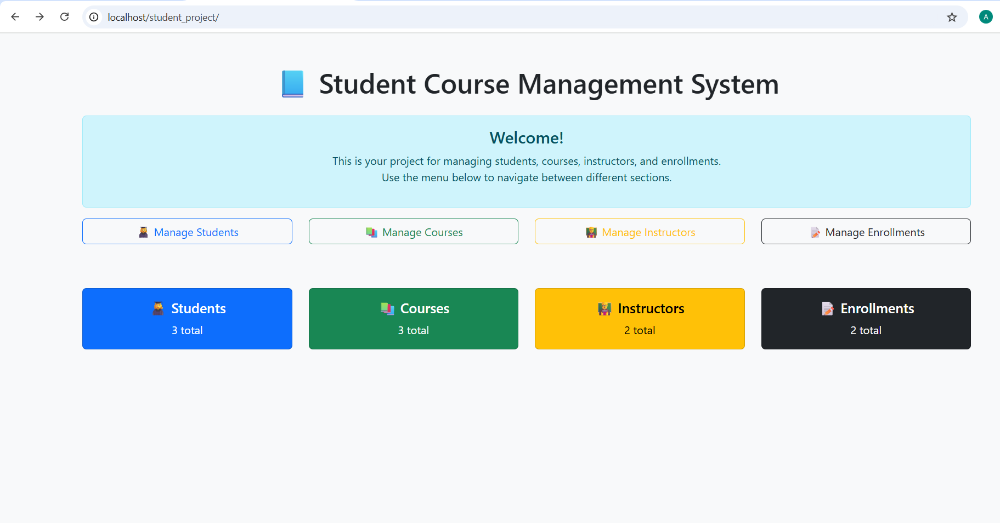
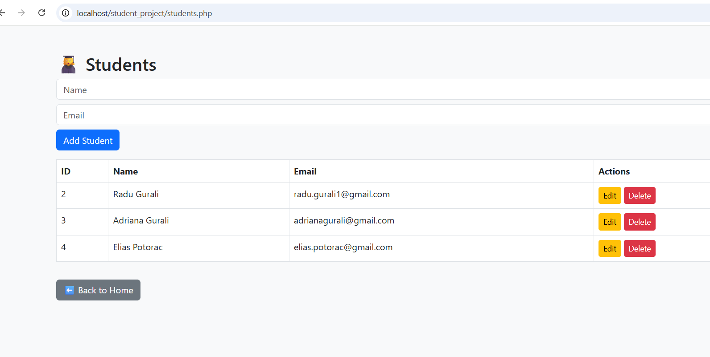
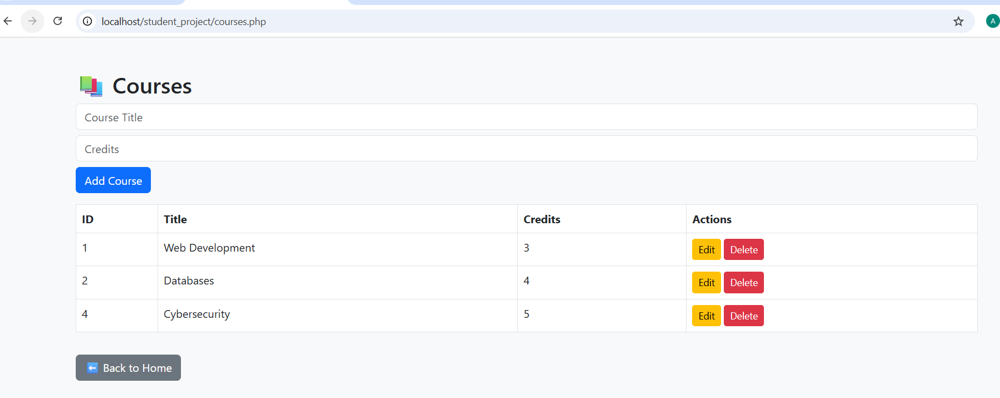
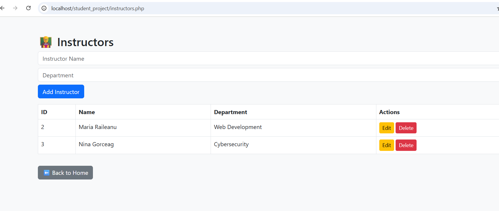
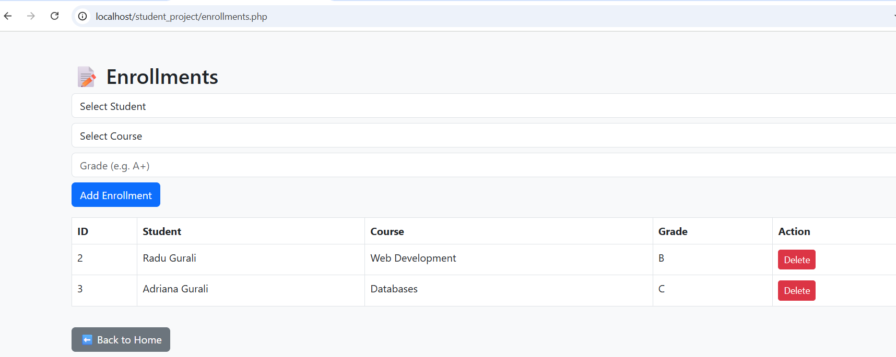

# 📸 Screenshots – Student Course Management System

### 1. Homepage
  
The homepage provides navigation to Students, Courses, Instructors, and Enrollments. It acts as the main dashboard of the system.

---

### 2. Students Page
  
The Students page allows adding new students with their details (e.g., name and email). It also provides options to edit or delete existing records.

---

### 3. Courses Page
  
The Courses page manages academic courses. Users can create new courses, update titles and credits, or delete existing ones.

---

### 4. Instructors Page
  
The Instructors page handles staff management. It allows adding instructors, assigning them to departments, and editing or removing records.

---

### 5. Enrollments Page
  
The Enrollments page connects students with courses and assigns grades. It demonstrates a many-to-many relationship between students and courses.